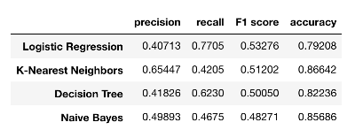

# Identifying Fraud from Enron Data

[Link to project report](https://nbviewer.jupyter.org/github/marty-vanhoof/Identifying_Fraud_from_Enron_Data/blob/master/enron_report.ipynb)

In this project, I work on building a few different machine learning models in order to identify fraudulent employees in the Enron scandal (called persons or interest, or POI).  This project evolved from a project in Udacity's [Intro to Machine Learning](https://www.udacity.com/course/intro-to-machine-learning--ud120) course.  It uses Python 3.x and the following Python libraries:

- [Numpy](http://www.numpy.org/)
- [Pandas](https://pandas.pydata.org/)
- [scikit-learn](http://scikit-learn.org/stable/)

## Results 

Since the dataset is so imbalanced (18 POI vs 128 non-POI), accuracy is not the best metric for measuring the performance of a machine learning classifier.  For this reason, I try to optimize both precision and recall and this is done by optimizing the F1 score, which is a weighted average of both.  The results are below, sorted by F1 score in descending order. 

Logistic regression has the highest recall and k-nearest neighbors has the highest precision.  In the future, I want to try to combine both these classifiers with an ensemble method (such as a [voting classifier](https://scikit-learn.org/stable/modules/ensemble.html#voting-classifier)) in order to get the best results from both.